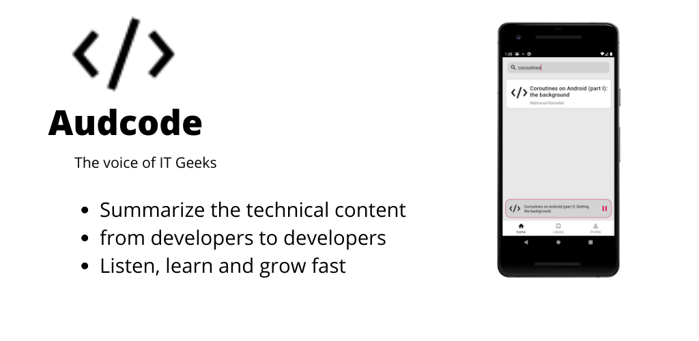

# Audcode API

this is Audcode API based on NodeJs,Express and MongoDB for
https://play.google.com/store/apps/details?id=com.audcode

## Features

1. Login/Signup
2. Get All Episodes
3. Create a new Episode
4. Upload a new Episode to AWS/Digital Ocean

## Architecture

I follow MVC Architecture Pattern
